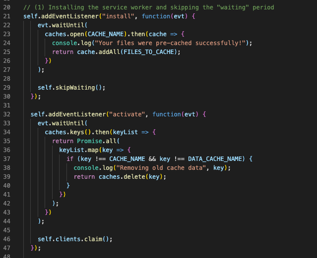
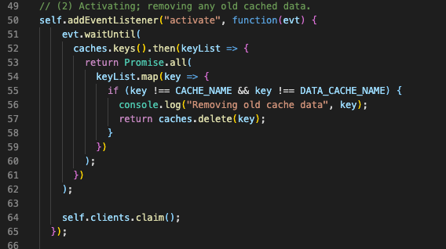
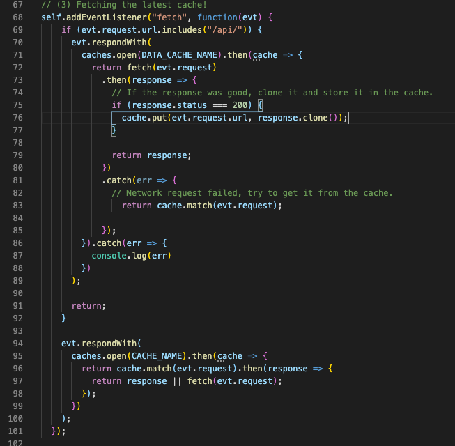
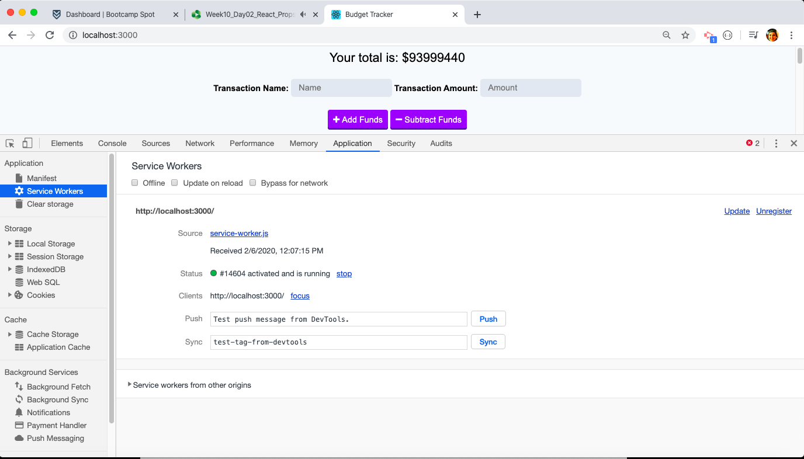
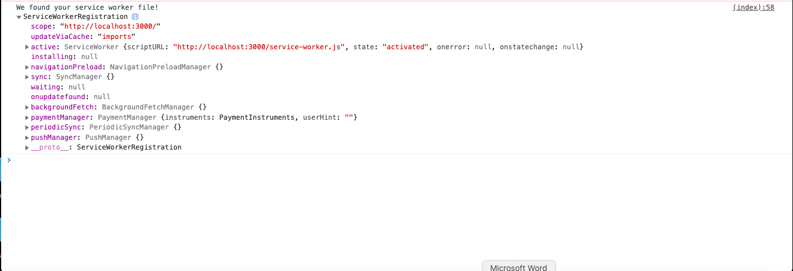

# PWA_budget_tracker
Progressive Web Application (PWA), online + offline budget tracker

### Heroku Deployed Application
https://arcane-springs-66515.herokuapp.com/

### GH Pages URL: https://pmahalan.github.io/PWA_budget_tracker/

The purpose of this project was to create a Progressive Web Application (PWA). Upon the deploying of my application, users will be able to install it on their mobile smart-devices, and view it and interact with it as they would any other mobile "application" (rather than viewing it was a webpage). Additionally, users will have the ability to view it in an app window on their desktop. In addition to the app-like appearance and functionality, my PWA utilizes service workers which allow the user to interact with the app offline; once online again, the app and browser will keep the information updated from whatever the user did while offline.

Through the use of service workers, any cached data populated when the app is used online or offline is updated through a series of steps. The lifecycle of service workers is as follows: (1) They're installed for the first time, (2) they are activated (at which point any outdated caches are wiped), and (3) the latest and most up-to-date cache replaces the previous one. 

